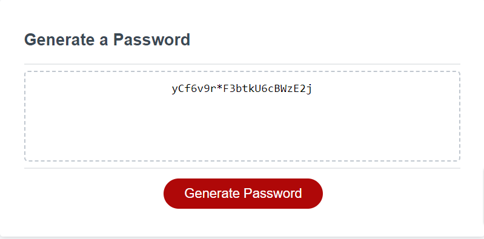

# secure-password-generator
a program that will allow you to generate a secure password based on user-inputted criteria

## Description

 We've designed an easy to use program that will generate a random, secure password!

- Just click the big red button, answer a few prompts regarding the details of your future password, and the generator will do the rest.

## Screenshots

- Image of final product 

- Example of generated password 

 

## Usage

Click the link to view your updated webpage: 
https://daymenpasick.github.io/semantic-seo-refactor/

## License

N/A

## Features

 - Ability to dictate password case-sensativity, the allowance of numbers and symbols, and the password length